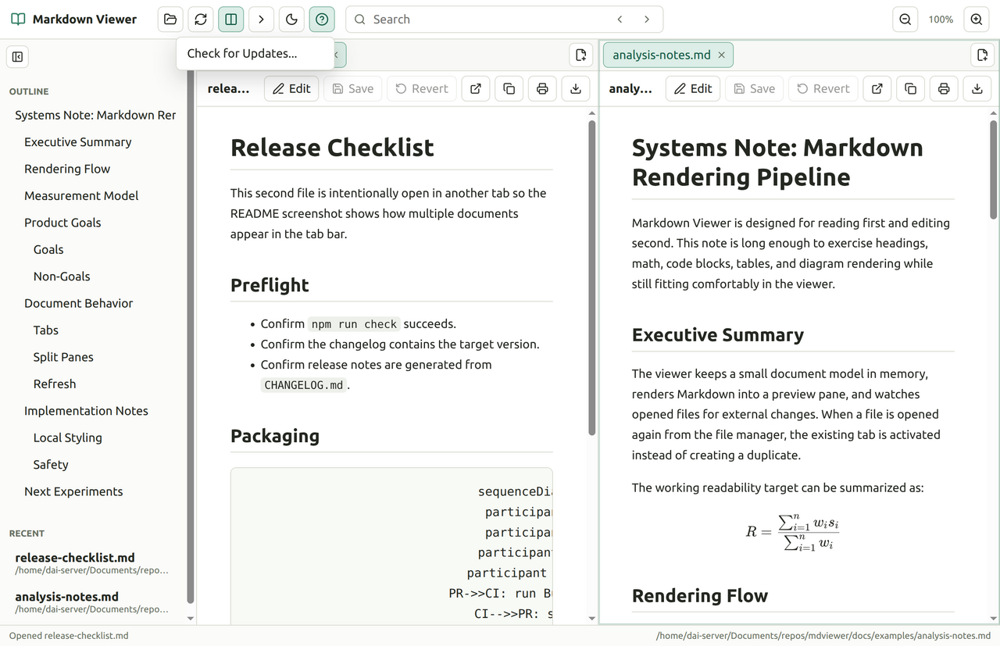

# Markdown Viewer

Markdown Viewer is a desktop Markdown viewer for Linux and Windows, with macOS available from source. It focuses on reading Markdown files quickly, while still offering light editing when needed.

## Screenshot



## Features

- Open Markdown files directly from the file manager
- Multiple tabs with split panes
- Drag tabs between split panes and split tabs left or right from the tab context menu
- Reuse an existing tab when the same file is opened again
- Automatic refresh when files change on disk
- Simple edit mode with save/revert
- LaTeX math support through KaTeX
- Mermaid diagram support
- Light/dark mode toggle
- Ctrl+scroll zoom
- Startup update checks with one-step install/restart confirmation and per-version skip
- In-app Help menu for manual update checks
- Outline, recent files, search, print, and PDF export
- CSS overrides from `~/.config/mdviewer/user.css`

## Install

Download the latest installer from [GitHub Releases](https://github.com/dainakai/mdviewer/releases).

### Ubuntu / Debian

The `.deb` package is the best option when you want the app installed into the desktop environment.

```bash
sudo apt install ./Markdown-Viewer-<version>-linux-amd64.deb
```

You can also double-click the `.deb` file in the file manager and install it with the system software installer.

The `.deb` package installs the app and desktop metadata. File managers may still require you to choose Markdown Viewer once as the default Markdown handler: right-click a `.md` file, choose **Open With**, select **Markdown Viewer**, and set it as the default if your desktop offers that option.

### Linux AppImage

The `.AppImage` package is portable. It runs without installing system files and does not register Markdown file associations by itself.

```bash
chmod +x Markdown-Viewer-<version>-linux-x86_64.AppImage
./Markdown-Viewer-<version>-linux-x86_64.AppImage
```

Some desktops also let you run it by double-clicking after you mark it executable. Use the `.deb` package if you want normal desktop installation and file association metadata.

### Windows

Download `Markdown-Viewer-<version>-win-x64.exe` from GitHub Releases and run the installer. The installer sets up Markdown Viewer and registers Markdown file associations; Windows may still require you to choose Markdown Viewer once from **Open with**.

Note: Windows installers are currently unsigned, so Windows SmartScreen may ask you to confirm before running the installer.

### macOS

macOS binary packages are not published at this time because signed and notarized packages are required for reliable distribution and updates. Use the source archive from GitHub Releases or clone the repository and run it locally:

```bash
npm install
npm run build
npm start
```

## Updates

Installed Linux and Windows builds check GitHub Releases on startup. When a newer version is available, Markdown Viewer asks once before downloading it, installing it, and restarting. You can skip a specific version from the startup prompt so it is not shown again automatically.

You can also use **Help > Check for Updates...** to check manually from the native menu or the in-app Help button. Manual update checks ask once before downloading, installing, and restarting. Update checks are disabled in local development runs.

macOS source runs do not use the in-app updater.

## Development

```bash
npm install
npm run dev
```

## File Manager Integration

```bash
npm install
npm run register
```

`npm run register` builds the app and registers the local Linux desktop integration:

- `~/.local/bin/mdviewer`
- `~/.local/share/applications/mdviewer.desktop`
- `~/.local/share/mime/packages/mdviewer-markdown.xml`

This lets supported file managers open Markdown files with Markdown Viewer from the file context menu or by double-clicking after the association is selected.

To remove the local integration:

```bash
npm run unregister
```

## CSS Customization

Markdown Viewer loads `~/.config/mdviewer/user.css` on startup when the file exists. Create that file to override the default viewer styles.
