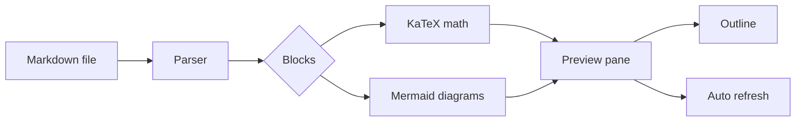

# Systems Note: Markdown Rendering Pipeline

Markdown Viewer is designed for reading first and editing second. This note is long enough to exercise headings, math, code blocks, tables, and diagram rendering while still fitting comfortably in the viewer.

## Executive Summary

The viewer keeps a small document model in memory, renders Markdown into a preview pane, and watches opened files for external changes. When a file is opened again from the file manager, the existing tab is activated instead of creating a duplicate.

The working readability target can be summarized as:

$$
R = \frac{\sum_{i=1}^{n} w_i s_i}{\sum_{i=1}^{n} w_i}
$$

## Rendering Flow

## Measurement Model

Here, $s_i$ is the block score and $w_i$ is the relative importance of the block. A practical viewer should keep $R$ high while reducing interaction cost:

$$
C = t_{open} + t_{scan} + t_{switch}
$$

The interface tries to minimize $C$ by keeping tabs stable, showing an outline, and refreshing changed files automatically.

## Product Goals

### Goals

- Keep Markdown documents readable at a glance.
- Preserve a fast path for opening files from the desktop.
- Support technical notes that mix prose, formulas, tables, and diagrams.

### Non-Goals

- It is not a full IDE.
- It does not try to replace specialized Markdown editors.
- It avoids project-level assumptions about how notes are organized.

## Document Behavior

### Tabs

Tabs are keyed by absolute path. If the same file is opened twice, the viewer focuses the existing tab and keeps the workspace predictable.

### Split Panes

Split panes are useful when comparing a design note with a release checklist. Empty panes can be closed without closing real documents.

### Refresh

External edits are picked up automatically for clean documents. If a document has unsaved local edits, the viewer marks it as changed and waits for the user to decide whether to reload.

## Implementation Notes

| Area | Behavior | User Impact |
| --- | --- | --- |
| Markdown | Parsed with heading IDs | Outline navigation works |
| Math | Rendered with KaTeX | Technical notes display formulas |
| Diagrams | Rendered with Mermaid | Architecture notes show flowcharts |
| Files | Watched with debounced events | Changes appear without manual reload |

### Local Styling

Users can override the preview with `~/.config/mdviewer/user.css`. This keeps personal reading preferences outside the application bundle.

### Safety

Raw HTML in Markdown is disabled. Mermaid diagrams are rendered from fenced code blocks, and the diagram renderer runs with strict security settings.

## Next Experiments

1. Improve icon assets for packaged builds.
2. Add signed and notarized macOS artifacts.
3. Add an automated screenshot check for README images.
