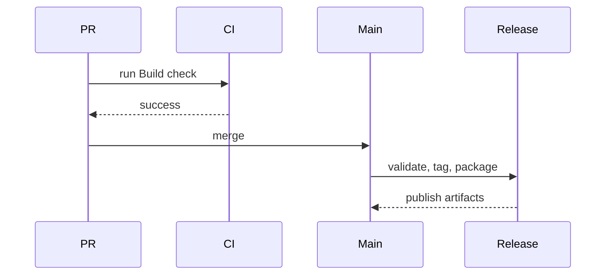

# Release Checklist

This second file is intentionally open in another tab so the README screenshot shows how multiple documents appear in the tab bar.

## Preflight

- Confirm `npm run check` succeeds.
- Confirm the changelog contains the target version.
- Confirm release notes are generated from `CHANGELOG.md`.

## Packaging

## Manual Smoke Test

Open a Markdown file from the file manager and verify that tabs, search, math, Mermaid, and file refresh still behave as expected.
